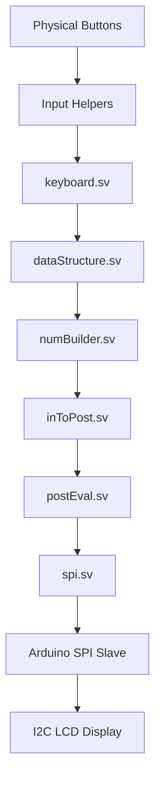

# Calculator Architecture Summary

This project implements a complete hardware-based scientific calculator pipeline on an FPGA. It processes keyboard inputs, builds numerical strings, handles complex mathematical formulas (with BEDMAS and trigonometry), evaluates the result using pipelined math cores, and broadcasts the status over SPI to an Arduino for LCD display.

## Overall Pipeline Dynamics

Here is the dynamic flow of data from physical input to visual output:

### 1. Input Handling
- **`input helpers/`** (`clockDivider`, `debouncer`, `decoder`): Raw button signals are cleaned up (debounced) and mapped into encoded signals.
- **`keyboard.sv`**: Takes the decoded press and maps it to specific 8-bit hex tokens representing digits (`0x00`-`0x09`), basic operators (e.g., ADD `0x2A`), constants (e.g., PI `0xC1`), or functions (e.g., SIN `0xF4`, EXP `0xF0`). It also handles pulse signals for `delete`, `insert`, and navigation `pointers`.

### 2. Expression Storage (Buffer)
- **`dataStructure.sv`**: Acts as a 1D memory array (stack/buffer) holding the equation as typed. It manages a `size` and a `ptr` (cursor index) so the user can use left/right inputs to edit the middle of an expression.

### 3. Parsing Phase
- **`numBuilder.sv`**: Fuses sequential single-digit tokens and decimal points (`0xDD`) into a unified token. The project uses a custom continuous 44-bit floating point format.
  - Number format: `{2'b00, sign[1 bit], mantissa[34 bits], exponent[7 bits]}`
  - Operator format: `{2'b01, zeroes[34 bits], token[8 bits]}`

### 4. Notation Translation 
- **`inToPost.sv`**: Employs the Shunting-Yard algorithm using an FSM. It consumes the tokenized array (Infix notation, e.g., `3 + 4 * 2`) and translates it into Reverse Polish Notation/Postfix notation (e.g., `3 4 2 * +`), handling operator precedence and resolving parentheses `()` gracefully.

### 5. Execution Logic
- **`postEval.sv`**: Iterates through the Postfix array to evaluate the equation. 
  - Uses an internal stack to push values. 
  - As soon as an operator or function is pulled, it pops 1 or 2 values to send to one of the math submodules (`adder`, `divider`, `pow_core`, `sin_core`, etc).
  - **Resource Sharing**: Because complex trigonometric or exponential modules are very large, they all multiplex access to a single instantiated `seq_multiplier` and `seq_divider`. The main FSM prevents module collisions.

### 6. Display Transmission
- **`spi.sv`**: (Master) Acts as the communication bridge. It concatenates the current page of the expression, the expression `size`, the `pointer` location, and the final 44-bit evaluated `answer` into chunks, then shifts them out bit-by-bit via Native SPI (`sclk`, `mosi`, `cs`).
- **`arduinoCodes`**: (Slave) The Arduino sits listening on an SPI interrupt. Once a 24-byte packet is populated, it parses the custom 44-bit mantissa/exponent structural data back into human-readable strings. It prints the mathematical expression on LCD Row 0 (with a blinking cursor tracking the FPGA's pointer) and places the final answer on LCD Row 1 via the `LiquidCrystal_I2C` library.
